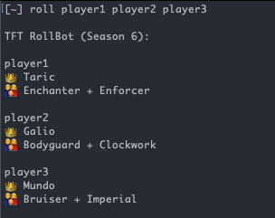

# Rollbot

A TFT Ultimate Bravery Rollbot for Discord and Terminal

Bot for rolling ultimate bravery for TFT.

If inputing multiple players, avoid giving people the same comps.

## Development

- Get Deno
- terminal: `deno run ./source/main.ts player1 player2 player3`
- run discord bot: `deno run --allow-net --unstable ./source/discord-bot.ts`

## Interfaces

### Discord

```
/roll

TFT RollBot (Season 6):
  👑 Graves
  👨‍👩‍👦 Academy + Twinshot
```

```
!roll @player1 @player2 @player3

TFT RollBot (Season 6):

@player1
  👑 Graves
  👨‍👩‍👦 Academy + Twinshot

@player2
  👑 Janna
  👨‍👩‍👦 Scrap + Clockwork

@player3
  👑 Yuumi
  👨‍👩‍👦 Scholar + Yordle
```

### Terminal



## Options

`--include-all` By default, we ignore 1-2 champion sets. This includes them.

`--no-dedupe` By default, we try to distribute traits and kings so that two
people don't have the same trait and don't have the same king. Adding no-dedupe
option means all traits are completely random.
